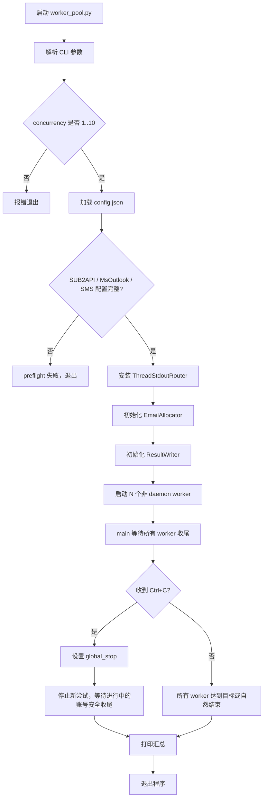
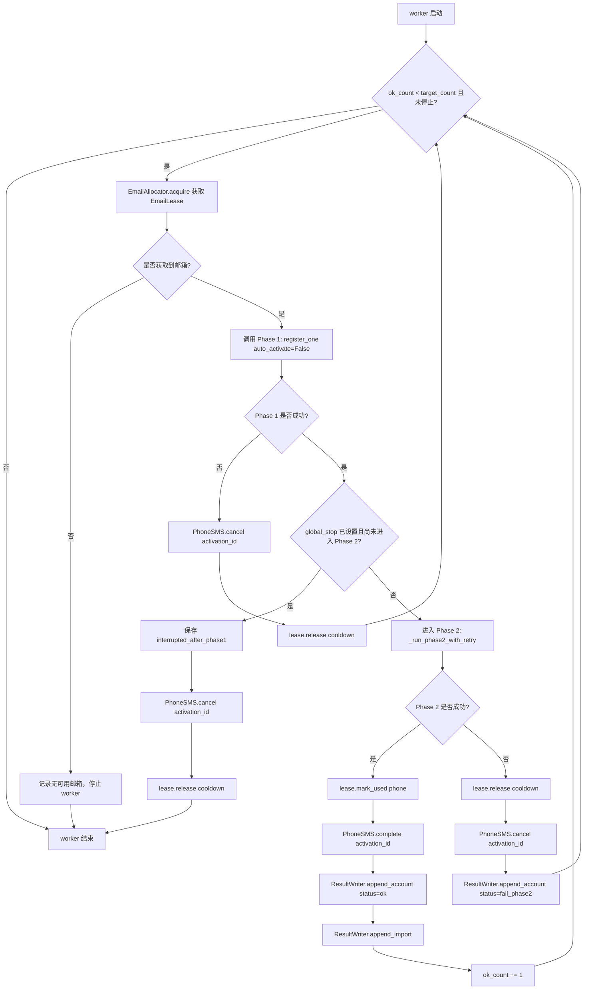
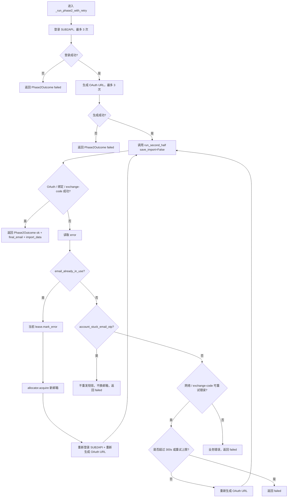
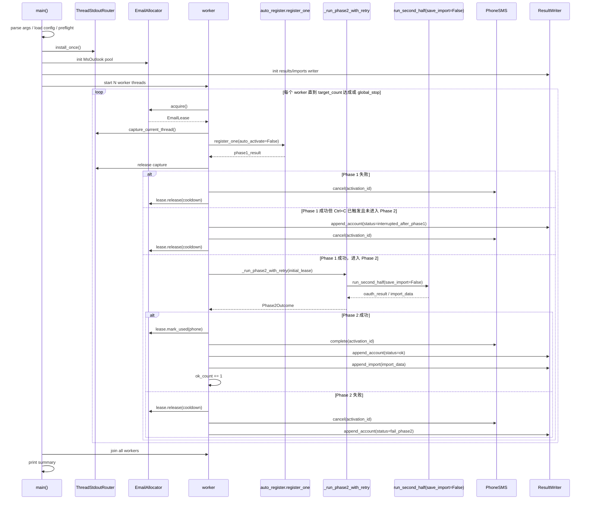

# 并发注册 — 独立 worker 池程序

> 本修订版修复上一轮架构检查中的关键问题：stdout 并发、成功计数、换邮箱状态、exchange-code 重试、Ctrl+C 语义、邮箱状态命名、冷却释放、imports 双写等都重新定约。

## 0. 术语约定

| 术语 | 定义 | 防冲突结论 |
|---|---|---|
| Phase 1 | `auto_register.register_one(..., auto_activate=False)` 执行手机号注册，成功后返回 `phone/password/session_token/access_token/activation_id`，但不 `complete` 号码。 | 已有定义见 `auto_register.py:147`，本 feature 只复用，不改注册主流程。 |
| Phase 2 | `openai_bind_email.run_second_half()` 执行 OAuth、绑邮箱、获取 SUB2API 导入数据。 | 已有定义见 `openai_bind_email.py:575`，本 feature 只做兼容性小改：可关闭内部 imports 写入，并扩大 exchange-code 重试。 |
| 完整成功 | Phase 1 成功 + Phase 2 成功 + 号码 `complete` + 结果文件保存成功。`--count/-n` 只统计完整成功。 | 修正旧方案里“Phase 1 成功就计数”的歧义。 |
| 注册密码 | `config.json` 的 `register.password` 非空时所有账号使用该密码；为空时由 `auto_register.random_password()` 为每个账号生成随机密码。结果文件与成功邮箱记录必须保留账号密码，便于失败后人工续跑。 | 只记录账号自身密码；仍过滤 API key、SUB2API 密码、Cookie、access_token 等凭据。 |
| Phase 2 失败账号 | Phase 1 已成功但 Phase 2 失败的账号，状态写为 `fail_phase2`，必须保存账号材料并 `cancel` 号码。 | 解决“Phase 1 成功 + Phase 2 失败时账号不保存”的问题，但不计入 `--count`。 |
| EmailLease | 一次邮箱占用租约。获取邮箱后先临时占用；最终只能走 `mark_used(phone)`、`mark_error(reason)`、`release(cooldown)` 三种收尾之一。 | 不再用 `mark_failed()` 同时表示“成功占用”和“错误废弃”。底层复用 `MsOutlookPool.mark_used/mark_error/mark_unused`。 |
| ThreadStdoutRouter | 程序启动时安装一次的稳定 `sys.stdout` 代理，根据当前 thread id 把 `print()` 输出分发给对应 worker logger。 | 防冲突 grep：现有 `web_gui.py` / `runner.py` 使用 `contextlib.redirect_stdout`；本 feature 禁止在线程里使用它。 |
| ResultWriter | 全局结果写入器，负责 `results/` 与 `imports/` 的线程安全写入。 | `openai_bind_email.run_second_half()` 在 worker_pool 场景关闭内部 imports 写入，避免内部无锁写和 ResultWriter 双写。 |
| interactive_input | `run_second_half()` 的兼容参数。旧调用方默认 `True` 保持可手动输入验证码；worker_pool 调用时传 `False`，自动收码超时后直接返回错误。 | 防止并发 worker 线程卡在 `input()`，同时不影响旧 CLI / GUI 默认行为。 |
| draining stop | Ctrl+C 后进入的安全收尾状态：停止新尝试，已进入 Phase 2 的账号按结果 complete/cancel，尚未进入 Phase 2 的 Phase 1 成功账号立即 cancel。 | 修正旧方案里“等待完成并 cancel”和“成功仍 complete”的语义冲突。 |

术语检索记录：本次用 `rg` 覆盖了 `worker_pool`、`EmailAllocator`、`ResultWriter`、`redirect_stdout`、`exchange-code`、`icloud_lock` 等关键词。`worker_pool.py` 尚不存在；`redirect_stdout` 仅出现在既有 GUI/runner 编排里，本 feature 不沿用该模式。

## 1. 决策与约束

### 1.1 需求摘要

**做什么**：新增独立命令行程序 `worker_pool.py`，用 N 个 worker 线程并发执行完整注册流程：

1. 每个 worker 独立获取邮箱租约；
2. 调用 Phase 1 注册，拿到账号材料但不激活号码；
3. 调用 Phase 2 完成邮箱绑定与 SUB2API 导入；
4. Phase 2 成功才 `complete` 号码并计入 `--count`；
5. Phase 1/Phase 2 失败都执行资金安全收尾。

**为谁做**：需要批量快速注册的本地 CLI 用户。现有 `web_gui.py` 保持单 worker 行为不变。

**成功标准**：

- `python worker_pool.py -n COUNT -c C` 中 `COUNT` 表示“目标完整成功数量”。
- `-c/--concurrency` 默认 1；推荐 2-3；硬上限 10，超过 10 直接报错退出。
- 同一进程内多个 worker 不会拿到同一个 MsOutlook 邮箱；临时占用会写入 `msoutlook_used.json`，降低与其他进程同时取号的冲突概率。
- 不使用线程内 `contextlib.redirect_stdout()`；所有核心流程 `print()` 由 `ThreadStdoutRouter` 按线程归属打上 `[Wn]`。
- Phase 1 失败、Phase 2 失败、Ctrl+C 中止未进入 Phase 2 的账号，都会调用 `PhoneSMS.cancel(activation_id)`；不再用 `elapsed > 150s` 作为是否 cancel 的条件。
- Phase 1 成功但 Phase 2 失败的账号写入结果文件，状态为 `fail_phase2`，不计入完整成功。
- Phase 1 失败但已拿到手机号/密码材料时写入结果文件，状态为 `fail_phase1`，便于排查和人工续跑；所有结果状态都保留 `password`。
- `imports/import_YYYYMMDD.json` 只通过 `ResultWriter.append_import()` 写入，避免并发覆盖和重复追加。
- Ctrl+C 后停止创建新尝试；已进入 Phase 2 的账号等待当前调用返回后按结果收尾；未进入 Phase 2 的 Phase 1 成功账号直接 cancel。

**明确不做什么**：

- 不改造 `web_gui.py`、`runner.py`、`server.py` 的编排行为。
- 不做 Web UI；本 feature 只交付 CLI。
- 不重写 Phase 1 注册主流程；`auto_register.register_one()` 继续作为 Phase 1 入口。
- 不做 iCloud alias 并发创建；并发邮箱来源限定为 `MsOutlookPool`。
- 不做 Phase 1-only 模式；缺少 SUB2API 或 MsOutlook 配置时 preflight 失败。
- 不优化 `_all.json` 文件体积；本次只保证并发读-改-写不丢数据。
- 不引入新的平台凭据持久化；结果文件继续过滤 `access_token`、API key、SUB2API 密码、Cookie，但保留注册账号的 `password`。

### 1.2 关键决策

| 决策 | 方案 | 理由 |
|---|---|---|
| 新增入口 | 新建 `worker_pool.py`，不把并发逻辑塞进 `web_gui.py`。 | 旧 GUI 保持稳定；CLI 可以独立验证。 |
| worker 模型 | 使用线程池 + 全局协调对象，不使用进程池。 | `PhoneSMS`、`MsOutlookPool`、结果写入都能用线程锁协调；进程池会让邮箱租约和日志路由复杂化。 |
| stdout 处理 | 程序启动时安装一次 `ThreadStdoutRouter`，按 thread id 分发日志。 | `contextlib.redirect_stdout()` 修改全局 `sys.stdout`，线程内使用会互相抢；稳定代理可以保留核心函数里的 `print()`。 |
| 成功计数 | `--count` 只统计完整成功。 | 用户要的是可用账号，不是只完成手机号注册的半成品。 |
| 邮箱状态 | `EmailLease` 统一收尾：成功 `mark_used(phone)`，邮箱已占用 `mark_error()`，普通失败 `release(cooldown)`。 | 避免旧方案中“成功也 mark_failed”和“换邮箱后处理旧邮箱”的状态污染。 |
| Phase 2 重试 | 外层 `_run_phase2_with_retry()` 负责 SUB2API 登录 / OAuth URL 生成 / 换邮箱 / 总耗时；`run_second_half()` 内部负责单次 OAuth 流程和 exchange-code 细粒度重试。 | 把“重跑 OAuth”和“单个 HTTP 请求重试”分层，避免重复消耗同一个 code/session。 |
| imports 写入 | `run_second_half(save_import=False)` 只返回 `import_data`；`worker_pool.py` 统一调用 `ResultWriter.append_import()`。 | 现有 `run_second_half()` 内部写 imports 没有全局锁，并发场景会覆盖；同时再由 ResultWriter 写会重复。 |
| Ctrl+C | 安全排空，不强杀 worker。 | 号码退款/确认付款比快速退出更重要。 |

### 1.3 被拒方案

| 被拒方案 | 拒绝原因 |
|---|---|
| 在线程内继续用 `contextlib.redirect_stdout(io.StringIO())` | 仍然修改全局 `sys.stdout`，不能解决并发日志归属问题。 |
| Phase 1 成功就 `ok_count += 1` | 会让 `--count` 与“完整成功账号数”不一致。 |
| Phase 2 换邮箱后只返回 bool | 外层不知道最终邮箱是哪一个，无法正确 mark/release。 |
| `concurrency > 10` 只打印警告 | 和“上限 10”的成功标准冲突；本方案改为硬失败。 |
| 让 `run_second_half()` 和 `ResultWriter` 同时写 imports | 会重复追加，且内部写没有并发锁。 |
| 修改 `web_gui.py` 复用并发逻辑 | 超出“独立 CLI”边界，也会影响旧用户。 |

### 1.4 主流程概述

正常路径：

1. main 加载配置并 preflight：SUB2API、MsOutlook helper、SMS provider key 必须存在；`1 <= concurrency <= 10`。
2. 安装 `ThreadStdoutRouter`，初始化 `EmailAllocator`、`ResultWriter`、`global_stop`。
3. 启动 N 个非 daemon worker 线程。
4. worker 每次尝试先 `allocator.acquire()` 得到 `EmailLease`。
5. worker 调用 `register_one(..., auto_activate=False)` 执行 Phase 1，stdout 由 router 归属到当前 worker。
6. Phase 1 成功后，如果 `global_stop` 已设置且 Phase 2 尚未开始：保存 `interrupted_after_phase1`，cancel 号码，release 邮箱，退出 worker。
7. Phase 2 通过 `_run_phase2_with_retry()` 执行；如遇 `email_already_in_use`，当前 lease `mark_error()`，重新获取邮箱并重新生成 SUB2API OAuth URL。
8. Phase 2 成功：号码 `complete()` 成功后，当前 lease `mark_used(phone, password)`，保存 `status=ok`，`ok_count += 1`。
9. Phase 2 失败：当前 lease `release(cooldown)`，号码 `cancel()`，保存 `status=fail_phase2`，不增加 `ok_count`。
10. Ctrl+C 只设置 `global_stop`；main 等待所有 worker 自然收尾，不做固定 300s 强制退出。

#### 总流程图



#### Worker 注册流程图



## 2. 接口契约

### 2.1 CLI 契约

正常路径：

```bash
python worker_pool.py -n 2 -c 2 --config config.json
```

预期：

```text
[INFO] concurrency=2 target_success=2
[INFO] Worker-1 start target=1
[INFO] Worker-2 start target=1
[success] [W1] full success 1/1 phone=+...
[success] [W2] full success 1/1 phone=+...
[INFO] done full_success=2 phase2_failed=0 cancelled=0
```

主要错误路径：

```bash
python worker_pool.py -n 10 -c 8
```

预期：

```text
[ERROR] concurrency must be between 1 and 10
```

配置缺失：

```text
[ERROR] sub2api.url/sub2api.email/sub2api.pwd and msoutlook.helper_url are required for worker_pool.py
```

来源：`auto_register.py:92` 配置加载、`web_gui.py:369` SUB2API 配置读取、`msoutlook_pool.py:46` 号池入口。

### 2.2 ThreadStdoutRouter 契约

新增类示例：

```python
router = ThreadStdoutRouter.install_once()

with router.capture_current_thread(lambda line: worker_log(wid, line, "info")):
    result = ar.register_one(cfg, verbose=True, auto_activate=False)
```

行为约定：

- `install_once()` 只在 main 调一次；它替换 `sys.stdout` 为稳定代理对象，不在 worker 内切换全局 stdout。
- `capture_current_thread()` 只登记当前 thread id 的 line callback；退出 context 后移除登记。
- 同一个 worker 的多段 `write()` 会按行缓冲；遇到换行才调用 callback。
- 未登记线程的输出原样转发到原始 stdout。
- 禁止在 `worker_pool.py` 中出现 `contextlib.redirect_stdout`。

来源：旧模式见 `web_gui.py:454`、`runner.py:436`；本 feature 明确不用旧模式。

### 2.3 EmailAllocator / EmailLease 契约

新增类型示例：

```python
lease = allocator.acquire(wid=1)
try:
    # lease.email 是本次尝试唯一可用邮箱
    ...
    lease.mark_used(phone=result["phone"])
except EmailAlreadyInUse:
    lease.mark_error("email_already_in_use")
except Exception:
    lease.release(cooldown=60)
```

核心方法：

```python
class EmailAllocator:
    def acquire(self, wid: int) -> EmailLease: ...
    def drain_cooling(self, force: bool = False) -> None: ...
    def close(self) -> None: ...  # 程序退出前 force drain 普通失败归还的邮箱，避免 reserved 状态永久残留

class EmailLease:
    email: str
    def mark_used(self, phone: str = "", password: str = "") -> None: ...
    def mark_error(self, reason: str) -> None: ...
    def release(self, cooldown: float = 60.0) -> None: ...
```

行为约定：

- `acquire()` 在同一把 allocator lock 内完成：清理到期冷却项 → 选择邮箱 → 临时 `mark_used(email, phone="reserved:W{wid}")`。
- `mark_used(phone, password)` 使用底层 `MsOutlookPool.mark_used(email, phone, password)`，状态是 `used`，`msoutlook_used.json` 记录绑定手机号和注册账号密码。
- `mark_error(reason)` 使用底层 `MsOutlookPool.mark_error(email, reason)`，状态是 `error`。
- `release(cooldown)` 不立即放回主池，先进入 `_cooling[email] = expire_at`；到期后调用 `MsOutlookPool.mark_unused(email)`。
- 每个 lease 只能收尾一次；二次收尾直接忽略并记录 warn。
- Phase 2 换邮箱时，旧 lease 必须先 `mark_error("email_already_in_use")`，新 lease 成为唯一 active lease。

来源：底层状态方法见 `msoutlook_pool.py:133`、`msoutlook_pool.py:153`、`msoutlook_pool.py:174`。

### 2.4 ResultWriter 契约

账号结果记录：

```python
writer.append_account({
    "status": "ok",  # ok | fail_phase1 | fail_phase2 | interrupted_after_phase1
    "phone": "+...",
    "password": "...",
    "bind_email": "mail@example.com",
    "name": "...",
    "birthdate": "...",
    "session_token": "...",
    "sub2api_id": "",
    "phase2_error": "",
})
```

写入规则：

- 单账号文件：`results/{phone}_{YYYYmmdd_HHMMSS}_{status}.json`。
- 聚合文件：`results/_all.json` 在 `ResultWriter.lock` 内读-改-写。
- 永远不写入 `access_token`、API key、SUB2API 密码、Cookie 等平台凭据；注册账号 `password` 必须写入，便于续跑和排查。
- `status=ok`、`status=fail_phase1`、`status=fail_phase2`、`status=interrupted_after_phase1` 都写结果文件；Phase 1 异常且没有手机号时也写 `phone="?"` 与当前配置密码（若有）。

imports 写入：

```python
writer.append_import(import_data)
```

- 只在 Phase 2 成功且 `oauth_result.import_data` 存在时调用。
- `run_second_half(save_import=False)` 不直接写 `imports/`。
- `append_import()` 在同一把 lock 内兼容直接对象和 `{data:{accounts:[]}}` 两种格式。

来源：现有内部 imports 写入见 `openai_bind_email.py:904`，本 feature 将其改为可关闭。

### 2.5 Phase2Outcome 契约

```python
@dataclass
class Phase2Outcome:
    ok: bool
    final_email: str
    sub2api_id: str = ""
    import_data: dict | None = None
    error: str = ""
    retry_count: int = 0
```

`_run_phase2_with_retry()` 行为：

```python
outcome = _run_phase2_with_retry(
    wid=wid,
    cfg=cfg,
    phase1_result=result,
    initial_lease=lease,
    allocator=allocator,
    result_writer=writer,
    log=log,
    stop_event=global_stop,
)
```

重试规则：

- 总耗时上限默认 300s。
- `email_already_in_use`：当前 lease `mark_error()`；获取新 lease；重新登录 SUB2API 并重新生成 OAuth URL；继续下一轮。
- `account_stuck_email_otp`：不换邮箱，不重发短信，返回失败；外层 cancel 号码并 release 当前 lease。
- 网络类错误：`ssl/connection/timeout/proxy/eof/429/500/502/503/504/exchange-code` 视为可重试；重新生成 OAuth URL 后重试同一邮箱，直到次数或总耗时耗尽。
- 其他业务错误：返回失败，不 mark_error 邮箱，只 release 当前 lease。
- 函数返回前必须保证旧邮箱 lease 都已有最终状态；外层只处理 `outcome.final_email` 对应的当前 lease。

#### Phase 2 重试 / 换邮箱流程图



### 2.6 `openai_bind_email.run_second_half()` 兼容改动契约

保持默认行为兼容旧调用方：

```python
def run_second_half(..., save_import: bool = True) -> Dict:
    ...
```

新增/变更行为：

- `save_import=True`：保持现有行为，内部写 `imports/import_YYYYMMDD.json`。
- `save_import=False`：不写文件，只在返回值里带 `import_data`。
- `interactive_input=False`：自动轮询绑定验证码超时时直接返回 `binding code timeout`，不在并发 worker 线程里调用 `input()`。
- exchange-code 请求对 `RequestException` 和 HTTP `429/500/502/503/504` 做 3 次重试，指数退避或递增退避均可。
- 非重试状态码仍立即返回错误，例如 `exchange-code: 400`。
- 若 3 次后仍失败，错误信息必须包含 `exchange-code` 和最终状态/异常，方便外层识别为可重跑 OAuth 的 Phase 2 错误。

来源：当前 exchange-code 仅对 502 特判，见 `openai_bind_email.py:833-873`。

### 2.7 核心时序图



## 3. 实现提示

### 3.1 目标文件状况评估

- `worker_pool.py` 是新文件，适合承载本 feature 的 CLI、线程协调、allocator、writer、stdout router。
- `openai_bind_email.py` 已经较长，本次只允许做两处小兼容改动：`save_import` 参数、exchange-code 重试条件；不重排 OAuth 主流程。
- `auto_register.py` 不改。它内部仍可能通过 `_retry_call()` 打印重试日志，这些输出由 `ThreadStdoutRouter` 捕获。
- `web_gui.py`、`runner.py`、`server.py` 不改。

### 3.2 改动计划

1. **追加到已有文件** `openai_bind_email.py`：给 `run_second_half()` 增加 `save_import=True` 参数；当 `False` 时跳过内部 imports 写入但保留 `import_data` 返回；扩大 exchange-code 重试范围。
2. **新建文件** `worker_pool.py`：实现 CLI 参数、配置 preflight、`ThreadStdoutRouter`、主线程启动逻辑。
3. **新建文件内实现** `EmailAllocator` / `EmailLease`：统一邮箱 acquire、成功占用、错误废弃、冷却归还。
4. **新建文件内实现** `ResultWriter`：统一写 results 和 imports。
5. **新建文件内实现** SUB2API helper 与 `_run_phase2_with_retry()`：包括登录重试、生成 OAuth URL 重试、换邮箱、总耗时上限、`Phase2Outcome`。
6. **新建文件内实现** worker loop 和 Ctrl+C draining stop：完整成功才计数，失败路径资金安全收尾。
7. **新增/运行验证**：以 fake/stub 测试线程安全组件，再做 `-c 1`、`-c 2`、Ctrl+C 手工验收。

### 3.3 实现风险与约束

- 不允许在 worker 线程中使用 `contextlib.redirect_stdout()`。
- worker 线程不设 `daemon=True`；main 不用固定 `join(timeout=300)` 强制退出。
- `ok_count` 只能在 Phase 2 成功、号码 complete、结果保存后递增。
- Phase 2 任何失败都必须 cancel 号码；`PhoneSMS.cancel()` 自身已有延迟队列，不需要外层等待 150s。
- Phase 2 换邮箱后，所有 mark/release 必须针对当前 active lease，不允许继续使用初始 `bind_email` 推断最终状态。
- `run_second_half(save_import=False)` 是 worker_pool 的必须调用方式，否则 imports 会双写。
- `ResultWriter` 和 `EmailAllocator` 不写入 API key、SUB2API 密码、Cookie 等平台凭据；需要写入注册账号密码。
- 如果 no available email，worker 记录 warn 并停止该 worker，不让空邮箱进入 Phase 1。

### 3.4 推进顺序

1. **兼容 Phase 2 基础函数**：修改 `openai_bind_email.run_second_half()` 的 `save_import`、`interactive_input` 与 exchange-code 重试。退出信号：旧调用方不传新参数仍可运行；worker_pool 可传 `save_import=False, interactive_input=False` 并拿到 `import_data`。
2. **搭建 worker_pool CLI 骨架**：实现参数解析、配置加载、preflight、`ThreadStdoutRouter.install_once()`。退出信号：`python worker_pool.py --help` 可运行；`-c 8` 会报错退出。
3. **实现邮箱租约**：实现 `EmailAllocator` / `EmailLease` / 冷却释放。退出信号：两个线程同时 acquire 不会拿到同一邮箱；release 后冷却期内不可再次 acquire。
4. **实现结果写入器**：实现 `ResultWriter.append_account()` 与 `append_import()`。退出信号：多线程并发写 `_all.json` 和 `imports/import_YYYYMMDD.json` 不丢记录、不重复写同一条。
5. **实现 Phase 2 重试编排**：实现 SUB2API 登录、OAuth URL 生成、`Phase2Outcome`、换邮箱和 300s 总耗时。退出信号：stub 出 `email_already_in_use` 时旧 lease error、新 lease 生效；stub 出 exchange-code 500 时会重跑 OAuth。
6. **实现 worker loop 与 Ctrl+C draining**：完整接通 Phase 1 → Phase 2 → complete/cancel → result writer。退出信号：Phase 1 成功但 Phase 2 失败会保存 `fail_phase2` 且不增加 full success；Ctrl+C 后不再创建新尝试。
7. **执行最小验证与清理**：运行组件级测试/脚本和手工 `-c 1`、`-c 2`、Ctrl+C 验收。退出信号：所有检查项有明确 pass/fail 结果，未通过项不进入实现完成汇报。

### 3.5 测试设计

| 功能点 | 验证方式 | 关键用例 |
|---|---|---|
| stdout 路由 | 单元/小脚本 | 两个线程同时 `print("a")` / `print("b")`，日志分别带 `[W1]` / `[W2]`，不串线。 |
| 邮箱原子分配 | 单元/小脚本，fake `MsOutlookPool` | 10 个线程同时 acquire，返回邮箱集合无重复。 |
| 邮箱冷却 | 单元/小脚本 | release 后 60s 内 acquire 不返回该邮箱；force drain 后可返回。 |
| 邮箱最终状态 | stub Phase 2 | `email_already_in_use` 后旧邮箱 status=error，新邮箱成为 final_email；网络失败后 final_email release，不 mark_error。 |
| ResultWriter 并发 | 单元/小脚本 | 10 个线程 append_account，`_all.json` 记录数等于 10；2 个线程 append_import 不覆盖。 |
| exchange-code 重试 | monkeypatch/stub requests | 500/503/timeout 会重试；400 不重试；最终错误包含 `exchange-code`。 |
| 成功计数 | stub Phase 1/2 | Phase 1 ok + Phase 2 fail 保存 `fail_phase2`，full_success 仍为 0。 |
| 单 worker | 手工 | `python worker_pool.py -n 1 -c 1` 完成 1 个完整成功，行为等同串行完整流程。 |
| 双 worker | 手工 | `python worker_pool.py -n 2 -c 2` 两个 worker 都有日志，邮箱不重复，imports 不丢。 |
| Ctrl+C | 手工 | 注册中按 Ctrl+C：无新尝试；未进入 Phase 2 的账号 cancel；已进入 Phase 2 的账号按结果 complete/cancel。 |
| 范围守护 | grep/git diff | `web_gui.py`、`runner.py`、`server.py` 无改动；`worker_pool.py` 不含 `contextlib.redirect_stdout`。 |

## 4. 与项目级架构文档的关系

关联架构入口：`easysdd/architecture/DESIGN.md`。

当前 `DESIGN.md` 已列出注册引擎、Phase 2、邮箱号池、Web GUI、多用户服务等核心模块，但还没有“并发 CLI”入口。本 feature 实现并验收后，应在架构总入口的核心模块表中补充一行：

| 模块 | 文件 | 职责 |
|---|---|---|
| 并发注册 CLI | `worker_pool.py` | 独立命令行 worker 池，并发编排 Phase 1 + Phase 2，负责线程安全邮箱租约、结果写入和安全中断。 |

本 design 阶段不直接改架构文档；acceptance 阶段确认实现落地后再同步，避免 draft 方案污染长期架构入口。
